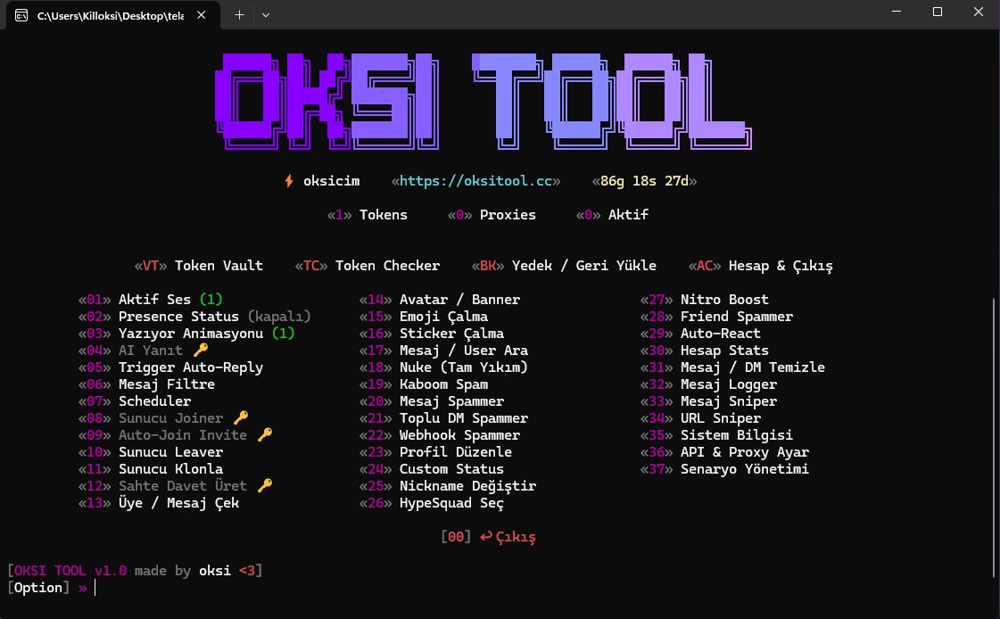

<!-- HERO BANNER -->
<a href="https://oksi.dev">
  
</a>

<div align="center">

<!-- ANIMATED TYPING -->
<a href="https://oksi.dev">
  
</a>

<br/>

<!-- BADGES — ROW 1 -->
<p>
  <a href="https://github.com/nurshia/oksitool/releases/latest"></a>
  <a href="https://github.com/nurshia/oksitool/releases"></a>
  <a href="https://github.com/nurshia/oksitool/stargazers"></a>
  <a href="LICENSE"></a>
</p>

<!-- BADGES — ROW 2 -->
<p>
  
  
  
  
  
</p>

<!-- NAV PILLS -->
<p>
  <a href="https://oksi.dev"><kbd>&nbsp;&nbsp;🌐&nbsp; Web Sitesi &nbsp;&nbsp;</kbd></a>
  <a href="#-indirme"><kbd>&nbsp;&nbsp;⬇&nbsp; İndir &nbsp;&nbsp;</kbd></a>
  <a href="#-özellikler"><kbd>&nbsp;&nbsp;✦&nbsp; Özellikler &nbsp;&nbsp;</kbd></a>
  <a href="#-fiyatlandırma"><kbd>&nbsp;&nbsp;💎&nbsp; Fiyatlar &nbsp;&nbsp;</kbd></a>
  <a href="#-sss"><kbd>&nbsp;&nbsp;?&nbsp; SSS &nbsp;&nbsp;</kbd></a>
</p>

</div>

<br/>

<!-- ABOUT -->
## ✦ OKSI TOOL Nedir?

**OKSI TOOL**, Discord için yazılmış, terminal tabanlı bir **premium multi-tool**'dur. Tek bir `.exe` indir, çift tıkla, kayıt ol — **33+ özellik**'in tamamı tek bir panelde, parmaklarının ucunda.

> [!TIP]
> 💜 **Premium aktivasyonu tool içinden.** [oksi.dev](https://oksi.dev) üzerinden key al → tool'da `Hesabım` sayfasına gir → key'i yapıştır → premium aktif. Dosya editleme yok, terminal komutu yok.

> [!IMPORTANT]
> Bu yazılım eğitim ve özel kullanım amaçlıdır. Discord ToS'una aykırı kullanım hesap askıya alma riski taşır — alt hesap kullanmanı öneririz.

<br/>

<!-- DEMO TERMINAL -->
## ▍ Canlı Demo

<div align="center">
<table>
<tr>
<td>

```text
╭─────────────────────────────────────────────╮
│  OKSI TOOL  v1.0.4                          │
│  ● Lifetime  ·  oksi@host  ·  aktif         │
╰─────────────────────────────────────────────╯

  [ 1] SES & PRESENCE       › 3 araç
  [ 2] AI & OTO-YANIT       › 3 araç
  [ 3] KATILMA & ÇIKMA      › 3 araç
  [ 4] SALDIRI ARAÇLARI     › 5 araç
  [ 5] HESAP YÖNETİMİ       › 6 araç
  [ 6] BİLGİ & ARAMA        › 3 araç
  [ 7] İZLEME & LOG         › 4 araç
  [ 8] GELİŞMİŞ             › 4 araç
  [ 9] SİSTEM & VAULT       › 2 araç
  [10] HESAP AYARLARI       › 3 araç

  › seçim _
```

</td>
</tr>
</table>
</div>

<br/>

<!-- FEATURES -->
## ✦ Özellikler

**10 kategori. 33 araç. Sıfır şişme.** Her şey ihtiyacın olduğu yerde.

<table>
<tr>
<th width="33%" align="left">

###### `01` Ses & Presence

</th>
<th width="33%" align="left">

###### `02` AI & Oto-Yanıt

</th>
<th width="33%" align="left">

###### `03` Katılma & Çıkma

</th>
</tr>
<tr>
<td valign="top">

- 24/7 Aktif Ses
- Rich Presence editör
- Yazıyor simülasyonu

</td>
<td valign="top">

- AI tabanlı akıllı yanıt
- Keyword auto-reply
- Yasak kelime filtresi

</td>
<td valign="top">

- Davet joiner
- Auto-join (toplu)
- Toplu leave

</td>
</tr>
<tr>
<th align="left">

###### `04` Saldırı Araçları

</th>
<th align="left">

###### `05` Hesap Yönetimi

</th>
<th align="left">

###### `06` Bilgi & Arama

</th>
</tr>
<tr>
<td valign="top">

- Nuke
- Kaboom
- Mesaj spam
- Toplu DM
- Webhook spam

</td>
<td valign="top">

- Profil editör
- Boost yönetimi
- HypeSquad
- Friend request
- Account cloner
- Cleanup

</td>
<td valign="top">

- Token checker
- Discord stats
- Gelişmiş arama

</td>
</tr>
<tr>
<th align="left">

###### `07` İzleme & Log

</th>
<th align="left">

###### `08` Gelişmiş

</th>
<th align="left">

###### `09` Sistem & Vault

</th>
</tr>
<tr>
<td valign="top">

- Logger
- Sniper (delete/edit)
- URL sniper
- Uptime monitor

</td>
<td valign="top">

- Auto-react
- Emoji steal
- Scenario engine
- Scheduler

</td>
<td valign="top">

- Şifreli Token Vault
- Sistem bilgisi
- Hesap ayarları

</td>
</tr>
</table>

<br/>

<!-- WORKFLOW DIAGRAM -->
## ▍ Nasıl Çalışıyor?

Tool'u açtığında üç farklı mod seni karşılayabilir. Hesap durumuna göre nereye düşeceğin değişir:

<table>
<tr>
<th width="33%" align="center">

###### `MOD 01` · 🟡 TRIAL

</th>
<th width="33%" align="center">

###### `MOD 02` · 🟣 FREE

</th>
<th width="33%" align="center">

###### `MOD 03` · 🔴 PREMIUM

</th>
</tr>
<tr>
<td valign="top" align="center">

**İlk kez kayıt olanlara özel**

Tüm `33+ araç` bir süreliğine açık. Tool'u keşfet, ne yaptığını gör, beğenirsen premium'a geç. Süre dolduğunda **Free**'ye düşer.

<sub>· Tüm araçlar · Sınırlı süre ·</sub>

</td>
<td valign="top" align="center">

**2. kez kayıt veya mevcut giriş**

Temel araçlar süresiz açık. Trial bittiğinde otomatik buraya düşer, aynı cihazdan tekrar kayıt olursan trial almazsın — direkt buraya gelirsin.

<sub>· Temel araçlar · Süresiz ·</sub>

</td>
<td valign="top" align="center">

**Key ile aktive edilir**

`Hesabım` sayfasından [oksi.dev](https://oksi.dev)'den aldığın key'i gir. `33+ aracın` tamamı plan süresince açık, vault sınırsız, destek öncelikli.

<sub>· Her şey · Plan süresince ·</sub>

</td>
</tr>
</table>

<br/>

**Aşağıdaki akış tam olarak ne yaşadığını gösteriyor:**

```mermaid
flowchart LR
    Start([📥 İndir & Çift Tıkla]) --> Login{🔐 Giriş Ekranı}

    Login -- İlk kez kayıt --> Trial[🟡 TRIAL MOD<br/><i>Tüm araçlar açık</i>]
    Login -- 2. kez kayıt --> Free[🟣 FREE MOD<br/><i>Temel araçlar</i>]
    Login -- Mevcut hesap --> Free

    Trial -- Süre dolar --> Free

    Free --> Choice{💎 Premium<br/>ister misin?}
    Choice -- Hayır --> KeepFree([✓ Free olarak devam])
    Choice -- Evet --> Buy[🛒 oksi.dev'den key al]
    Buy --> Account[👤 Tool → Hesabım]
    Account --> KeyEntry[🔑 Key'i yapıştır]
    KeyEntry --> Premium([🔴 PREMIUM AKTİF<br/>33+ araç kullanıma hazır])

    classDef start fill:#9b5cff,stroke:#b87aff,color:#fff,stroke-width:2px
    classDef trial fill:#2a1d0e,stroke:#ffbd2e,color:#ffbd2e,stroke-width:2px
    classDef free fill:#1a0f2e,stroke:#9b5cff,color:#b87aff,stroke-width:2px
    classDef premium fill:#3a0f1f,stroke:#ff3b6b,color:#ff5e88,stroke-width:2px
    classDef decision fill:#1a0f2e,stroke:#b87aff,color:#f5f0ff,stroke-width:2px
    classDef step fill:#0d0719,stroke:#6b5d8a,color:#a89cc4

    class Start start
    class Trial trial
    class Free free
    class Premium,KeepFree premium
    class Login,Choice decision
    class Buy,Account,KeyEntry step
```



> [!NOTE]
> **Trial süresi sadece ilk kez kayıt olan hesaba verilir.** Aynı cihazdan yeni hesap açarsan trial almazsın — direkt Free moda düşersin. Bu trial farm'ı engellemek için.

<br/>

<!-- DOWNLOAD -->
## ⬇ İndirme

<div align="center">

### 📥 [**oksi.dev**](https://oksi.dev) üzerinden son sürümü indir

| Platform | Dosya | Boyut | Durum |
|:---:|:---:|:---:|:---:|
|  | `oksitool.exe` | `~52 MB` |  |
| -3DDC84?style=flat&logo=android&logoColor=white) | `oksitool-termux-aarch64` | `~30 KB` |  |
|  | `oksitool-macos` | — |  |
|  | `oksitool-linux` | — |  |

<br/>

<a href="https://oksi.dev">
  
</a>

</div>

> [!NOTE]
> İndirilen `.exe` çift tıklandığında otomatik olarak son sürümü çeker, cihazını tanır ve seni giriş ekranına alır. Manuel kurulum gerektirmez.

<br/>

<!-- INSTALLATION DETAIL -->
## ▍ Kurulum Adımları

<table>
<tr>
<td width="33%" valign="top">

#### `①` İndir
[**oksi.dev**](https://oksi.dev) üzerinden platformuna uygun sürümü indir.

</td>
<td width="33%" valign="top">

#### `②` Çalıştır
Çift tıkla. Tool kendini açar, son sürümü çeker ve seni karşılar.

</td>
<td width="33%" valign="top">

#### `③` Premium Aktif Et
Kayıt ol → `Hesabım` → oksi.dev'den aldığın key'i yapıştır.

</td>
</tr>
</table>

<details>
<summary><b>🪟 Windows için detaylı talimatlar</b></summary>
<br/>

```text
1. oksi.dev → "Windows İçin İndir"
2. oksitool.exe dosyasını çalıştır
3. Windows Defender uyarısı çıkarsa "Daha fazla bilgi" → "Yine de çalıştır"
4. Tool otomatik olarak son sürümü indirir
5. Giriş ekranı açılır → kayıt ol veya giriş yap
```

</details>

<details>
<summary><b>🤖 Android (Termux) için kurulum</b></summary>
<br/>

**1.** Önce **F-Droid** veya **GitHub** üzerinden **Termux** uygulamasını kur (Google Play sürümü çalışmaz):
- F-Droid: https://f-droid.org/packages/com.termux/
- GitHub: https://github.com/termux/termux-app/releases/latest (`termux-app_*_arm64-v8a.apk`)

**2.** Termux'u aç, tek komutu yapıştır:

```bash
curl -fsSL https://raw.githubusercontent.com/nurshia/oksitool/main/install-termux.sh | bash
```

**3.** Kurulum biter bitmez:

```bash
oksitool
```

Script otomatik olarak `nodejs-lts`, `curl`, `jq`, `tar` paketlerini kurar, son sürümü `~/.oksitool/` altına indirir ve `oksitool` komutunu PATH'e bağlar. Otomatik güncelleme açıktır — sonraki açılışlarda yeni sürüm varsa kendiliğinden çekilir.

> Sadece **aarch64 (64-bit ARM)** cihazlar destekleniyor. Çoğu güncel Android cihaz aarch64.

</details>

<details>
<summary><b>🍎 macOS &nbsp;·&nbsp; <kbd>çok yakında</kbd></b></summary>
<br/>

macOS sürümü üzerinde çalışıyoruz, **çok yakında** yayında olacak. Çıktığında bu bölüm Terminal komutlarıyla güncellenecek.

</details>

<details>
<summary><b>🐧 Linux &nbsp;·&nbsp; <kbd>çok yakında</kbd></b></summary>
<br/>

Linux x64 sürümü üzerinde çalışıyoruz, **çok yakında** yayında olacak. Çıktığında bu bölüm kurulum komutlarıyla güncellenecek.

</details>

<br/>

<!-- UNINSTALL -->
### 🗑 Kaldırma

<details>
<summary><b>🪟 Windows'tan kaldırma</b></summary>
<br/>

```text
1. oksitool.exe dosyasını sil
2. %LOCALAPPDATA%\oksitool klasörünü sil (oturum + cache)
```

`%LOCALAPPDATA%\oksitool` içinde session token ve indirilen runtime modülleri durur. Klasörü silmek hesabını silmez — sadece bu cihazdaki tüm yerel iz kalkar.

</details>

<details>
<summary><b>🤖 Android (Termux) kaldırma</b></summary>
<br/>

Termux'ta tek satır:

```bash
rm -rf ~/.oksitool && rm -f $PREFIX/bin/oksitool
```

- `~/.oksitool` → binary, launcher, node_modules, session
- `$PREFIX/bin/oksitool` → PATH'e bağlanan komut symlink'i

İsterseniz `nodejs-lts` ve diğer Termux paketlerini de kaldırabilirsiniz, ama başka şeyler için gerekebilir — opsiyonel.

</details>

> Hesabını tamamen silmek istiyorsan tool'da `Hesap & Çıkış` ekranından **Hesabı Sil** opsiyonunu kullan veya support@oksi.dev'e yaz. Dosyaları silmek hesabı sunucudan silmez.

<br/>

<!-- PRICING -->
## 💎 Fiyatlandırma

<div align="center">

| | **Free** | **Starter** | **Pro** ⭐ | **Lifetime** |
|---|:---:|:---:|:---:|:---:|
| **Fiyat** | `$0` | `$19.99` | `$49.99` | `$149.99` |
| **Süre** | süresiz | 1 ay | 3 ay | ömür boyu |
| Temel araçlar | ✓ | ✓ | ✓ | ✓ |
| Tüm 33+ araç | — | ✓ | ✓ | ✓ |
| Token Vault | sınırlı | ✓ | sınırsız | sınırsız |
| Öncelikli destek | — | — | ✓ | ✓ |
| Erken erişim | — | — | ✓ | ✓ |
| VIP kanal | — | — | — | ✓ |
| Tüm güncellemeler | — | süre boyu | süre boyu | **ömür boyu** |
| | [İndir](https://oksi.dev) | [Satın Al](https://oksi.dev) | **[Satın Al](https://oksi.dev)** | [Satın Al](https://oksi.dev) |

</div>

> [!TIP]
> En çok tercih edilen **Pro** plan — Starter'a göre %17 indirim, Lifetime'a göre düşük başlangıç. Memnun değilsen **48 saat içinde** koşulsuz iade.

<br/>

<!-- SCREENSHOT -->
## 📸 Ekran Görüntüsü

<div align="center">



<sub><b>Ana Menü</b> — 10 kategori, 33 araç tek panelde</sub>

</div>

<br/>

<!-- SECURITY -->
## 🔒 Güvenlik & Gizlilik

<table>
<tr>
<td width="33%" align="center" valign="top">

#### 🛡️
**Cihaz Kilidi**

Hesabın bir cihaza bağlıdır. Cihaz değiştirmek için reset hakkın var.

</td>
<td width="33%" align="center" valign="top">

#### 🔐
**Token Güvenliği**

Discord token'ların cihazında şifreli tutulur, dışarı çıkmaz.

</td>
<td width="33%" align="center" valign="top">

#### 👁️‍🗨️
**Sıfır Telemetri**

Tool seni izlemez, kullanım datası toplamaz.

</td>
</tr>
</table>

<br/>

<!-- REQUIREMENTS -->
## ⚙ Sistem Gereksinimleri

| | Minimum | Önerilen |
|---|---|---|
| **OS** | Windows 10 / Android 7+ (Termux) | Windows 11 / Android 12+ |
| **Mimari** | x86_64 / aarch64 | — |
| **RAM** | 512 MB | 1 GB |
| **Disk** | 200 MB | 500 MB |
| **Bağlantı** | Stabil internet | — |

> macOS ve Linux x64 sürümleri çok yakında.

<br/>

<!-- FAQ -->
## ❓ SSS

<details>
<summary><b>Tool nasıl çalışıyor?</b></summary>
<br/>
İndir, çift tıkla. Tool kendini açar, seni giriş ekranına alır. Kayıt ol, premium aldıysan biz hesabını yükseltiriz, tüm özellikler aktif olur. Kurulum yok, ayar yok, derdi yok.
</details>

<details>
<summary><b>Premium'a nasıl geçerim?</b></summary>
<br/>
Tool'u indir, kayıt ol. <a href="https://oksi.dev">oksi.dev</a> üzerinden plan seç ve <strong>key</strong> al. Tool'da <code>Hesabım</code> sayfasına gir, key'i yapıştır — premium anında aktif olur. <em>Direkt ödeme yöntemi şu an kapalı, sadece key ile aktivasyon var.</em>
</details>

<details>
<summary><b>Discord beni banlar mı?</b></summary>
<br/>
Selfbot kullanımı Discord ToS'una aykırıdır ve <strong>hesap askıya alma riski taşır</strong>. Ana hesabını kullanmamanı, alt hesap üzerinde test etmeni öneririz. Sorumluluk tamamen kullanıcıya aittir.
</details>

<details>
<summary><b>Birden fazla cihazda kullanabilir miyim?</b></summary>
<br/>
Tek hesap = tek cihaz. Cihaz değiştirmek istersen <a href="https://oksi.dev">oksi.dev</a> üzerinden <strong>cihaz reset</strong> talep et. 24 saatte 1 ücretsiz reset hakkın var.
</details>

<details>
<summary><b>Lisans bitti, ne olur?</b></summary>
<br/>
Tool free moda düşer, premium özellikler devre dışı kalır. Hesabın silinmez — premium yenileyince kaldığın yerden devam edersin.
</details>

<details>
<summary><b>İade alabilir miyim?</b></summary>
<br/>
Evet. Aktivasyondan sonra <strong>48 saat</strong> içinde sebep sormadan iade alabilirsin. 48 saatten sonra iade yok.
</details>

<details>
<summary><b>Windows Defender uyarı verir mi?</b></summary>
<br/>
Yeni bir <code>.exe</code> olduğu için ilk açılışta SmartScreen uyarısı çıkabilir. <strong>"Daha fazla bilgi"</strong> → <strong>"Yine de çalıştır"</strong> ile geçebilirsin. Her sürümde topluluk tarafından doğrulandıkça uyarı kalkar.
</details>

<br/>

<!-- ROADMAP -->
## 🗺 Yol Haritası

- [x] Terminal tabanlı UI
- [x] 33+ özellik · 10 kategori
- [x] Windows desteği
- [x] **Android (Termux) desteği** — aarch64
- [x] Premium üyelik sistemi (key bazlı)
- [x] Token Vault (şifreli)
- [x] Otomatik güncelleme (mobil ve masaüstü)
- [ ] **macOS sürümü** &nbsp;`çok yakında`
- [ ] **Linux x64 sürümü** &nbsp;`çok yakında`
- [ ] Direkt ödeme yöntemi (kart/havale)
- [ ] Web dashboard
- [ ] Plugin sistemi (geliştirici API)

<br/>

<!-- STATS -->
## 📊 Repo İstatistikleri

<div align="center">

<a href="https://github.com/nurshia/oksitool">
  
</a>

<br/><br/>

<a href="https://star-history.com/#nurshia/oksitool&Date">
  
</a>

</div>

<br/>

<!-- LICENSE -->
## 📜 Lisans

Bu proje [Proprietary License](LICENSE) altında dağıtılmaktadır. Kaynak kodu paylaşımı, tersine mühendislik veya yeniden satış yasaktır.

```
Copyright © 2026 OKSI. Tüm hakları saklıdır.
```

<br/>

<!-- CONTACT -->
## 💬 İletişim

<div align="center">

<a href="https://oksi.dev"></a>
<a href="mailto:support@oksi.dev"></a>
<a href="https://github.com/nurshia/oksitool/issues"></a>

</div>

<br/>

<!-- FOOTER -->


<div align="center">

<sub><b>OKSI TOOL</b> · made by <a href="https://github.com/nurshia">@nurshia</a> · © 2026</sub>

</div>